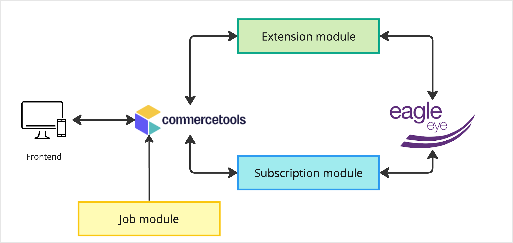

# integration-commerce-tools

`integration-commerce-tools` provides an integration between Eagle Eye Air and commercetools.
The integration is available to install with commercetools Connect or can be customized and hosted on a different
provider.

## Supported features

* Promotions
* Voucher codes
* Loyalty points
* Settling of the transaction
* Enriched baskets cleanup

## Overview

This repository provides a single Node JS application that contains three modules: the Extension module, the
Subscription module and the Job module.

* The Extension module is triggered on cart updates and adds to the cart promotions and loyalty points.
* The Subscription module is triggered when the order is updated and handles the settling of the transaction in Eagle
  Eye.
* The Job module is triggered by a cron job and handles the removal of old Eagle Eye enriched baskets from commercetools
  custom objects.

## Plugin Installation

See the [plugin installation documentation](integration/docs/installation.md).

## How it works

See the [how it works](integration/docs/how-it-works.md) section for all the details about the plugin internals.

## Plugin development and customization

The process of setting up commercetools can differ based on the specific implementation, and the integration needs may
also vary in each scenario. Due to these variations, the plugin is distributed as an open-source application to
facilitate the integration of these systems. This way, individuals can freely download, host, and customize the
solution according to their distinct business needs.
See [plugin development and customization](integration/docs/development.md) documentation for all the details on how to
customize the plugin and how to get it running locally.

# Contributing Guides lines

To contribute to this project please see there guidelines here: [CONTRIBUTING](./CONTRIBUTING.md)
